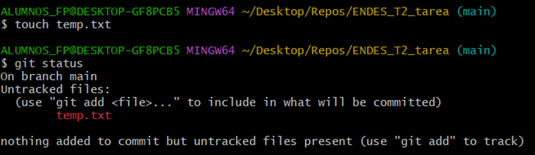

# TE ENDES Tema 2
## Subtarea 1: Uso de GitHub y Git

    5. Dentro de la carpeta del repositorio, ejecuta un comando que muestre los contenidos de la carpeta para ver que el repositorio está vacío o solo contiene el archivo README.

 

    6. Una captura de pantalla del resultado de ejecutar git status cuando el repositorio está "al día".

 
 
En este paso, creé un archivo README, lo subí e hice el commit y después ejecuté el comando git status para comprobar que el repositorio estaba “al día”.

    7. Una captura de pantalla del resultado de ejecutar git status cuando hay un archivo nuevo que git todavía no está rastreando.

 

Al igual que en el paso anterior, creé un archivo (temp.txt) de prueba y lo subí, esta vez sin realizar el commit.

    8. Una captura de pantalla del resultado de ejecutar git status cuando hay archivos en la fase staged, es decir; están preparados para hacer un commit.

 

Con el comando add . añadí el archivo .txt a la fase de preparación (stage) y con git status pude comprobar su estado.

    9. Una captura de pantalla del resultado de ejecutar git status cuando el repositorio local está al día tras haber realizado cambios, pero no está sincronizado con GitHub.

 

Tras realizar el commit, utilicé git status para consultar el estado del repositorio.

    10. Una captura de pantalla del resultado de sincronizar nuestro repositorio Git local con el repositorio en GitHub.

 

## Subtarea 2: Comparación de dos IDEs o editores de texto

Recomendación: Es buena costumbre, además de guardar periódicamente nuestro archivo a medida que
trabajamos, actualizar nuestro repositorio cada vez que se haga un cambio relevante en el código. En este caso,
aun tratándose de un archivo de texto, podemos hacer varios commits que reflejen el avance de la tarea.
Cuando yo acceda a vuestro repositorio, debería ver al menos tres commits en distintas fases, pero podéis
hacer los que creáis oportunos.
Elige dos IDEs o editores de texto. Realiza una comparación de estos atendiendo a:
• Lenguajes de programación compatibles.
• Facilidad de uso.
ENTORNOS DE DESARROLLO
TAREA 2
www.tuniversformacion.es 2
• Depuración.
• Gestión de versiones.
• Personalización y extensibilidad.
• Otros aspectos que te resulten de interés.

## Subtarea 3: Tu herramienta favorita.

Elige el componente de IDE o herramienta CASE que crees que te va a ahorrar más trabajo o facilitar más la
vida en tu labor como programador. Justifica tu elección. No hay respuestas correctas o incorrectas; lo
importante es cómo justificas tu opinión