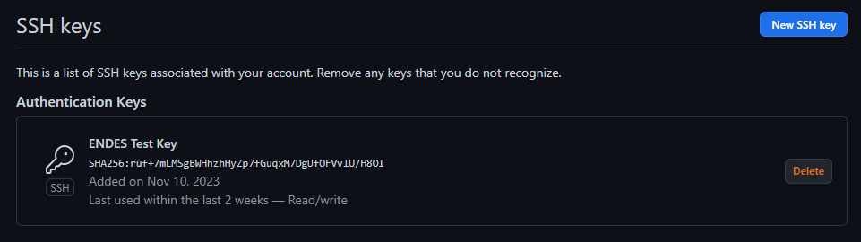
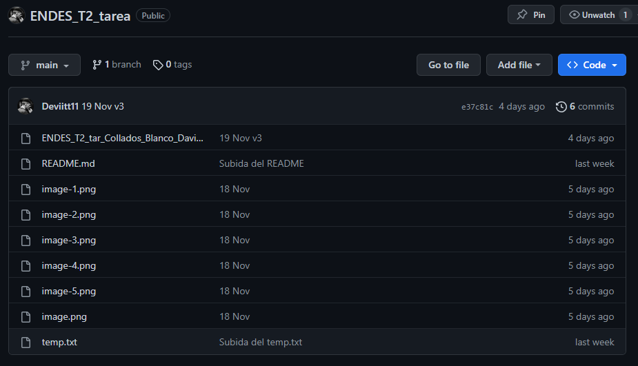
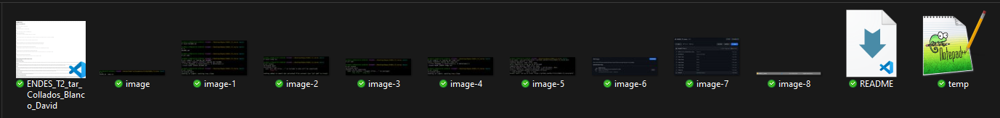

# TE ENDES Tema 2
## Subtarea 1: Uso de GitHub y Git

### Uso de GitHub

    1. Crear un perfil en GitHub si no lo tenemos todavía.

https://github.com/Deviitt11

    2. Configurar nuestra llave SSH si no lo hemos hecho todavía.

 

    3. Crear un repositorio público en GitHub con el nombre ENDES_T2_tarea.

https://github.com/Deviitt11/ENDES_T2_tarea

    4. Clonar el repositorio vacío (puede tener un Readme.md si queréis, pero no es necesario).

### Uso de Git Bash

    5. Dentro de la carpeta del repositorio, ejecuta un comando que muestre los contenidos de la carpeta para ver que el repositorio está vacío o solo contiene el archivo README.

 

    6. Una captura de pantalla del resultado de ejecutar git status cuando el repositorio está "al día".

 
 
En este paso, creé un archivo README, lo subí e hice el commit y después ejecuté el comando git status para comprobar que el repositorio estaba “al día”.

    7. Una captura de pantalla del resultado de ejecutar git status cuando hay un archivo nuevo que git todavía no está rastreando.

 

Al igual que en el paso anterior, creé un archivo (temp.txt) de prueba y lo subí, esta vez sin realizar el commit.

    8. Una captura de pantalla del resultado de ejecutar git status cuando hay archivos en la fase staged, es decir; están preparados para hacer un commit.

 

Con el comando add . añadí el archivo .txt a la fase de preparación (stage) y con git status pude comprobar su estado.

    9. Una captura de pantalla del resultado de ejecutar git status cuando el repositorio local está al día tras haber realizado cambios, pero no está sincronizado con GitHub.

 

Tras realizar el commit, utilicé git status para consultar el estado del repositorio.

    10. Una captura de pantalla del resultado de sincronizar nuestro repositorio Git local con el repositorio en GitHub.

 

## Subtarea 2: Comparación de dos IDEs o editores de texto

### Visual Studio Code vs Eclipse

#### Lenguajes de programación compatibles

Visual Studio Code admite una amplia variedad de lenguajes de programación gracias a sus extensiones. Algunos de estos lenguajes son: Java, Python, JavaScript, HTML, CSS, C#, entre muchos más. Mientras que Eclipse es un entorno de desarrollo más tradicional y está basado en el desarrollo de Java. Sin embargo, existen plugins para lenguajes como Python, PHP, C...

#### Facilidad de uso

La facilidad es un aspecto subjetivo y también depende del uso que le demos al IDE y el objetivo que tengamos en mente. VS Code es, en general, más fácil de usar que Eclipse. Esto se debe a su interfaz más minimalista e inicio rápido, especialmente para tareas más simples o proyectos pequeños. Eclipse puede ser más poderoso, pero cuenta con una configuración inicial e interfaz que podrían resultar complejas a algunos usuarios. Personalmente, VS Code me ayuda mucho a la hora de trabajar con Python, HTML o CSS. Sin embargo, me resulta un poco dificil a la hora de trabajar con Java, por lo que opto por usar Eclipse o NetBeans para ese lenguaje.

#### Depuración

VS Code proporciona una interfaz de depuración intuitiva y fácil de usar. La barra lateral muestra información detallada sobre variables, expresiones y el estado actual del programa durante la ejecución. Eclipse tiene una perspectiva de depuración que ofrece una cantidad mayor de herramientas que VS Code, destacando la visualización de variables y el control de la ejecución como componentes clave. En ambos IDEs podemos utilizar breakpoints de manera similar. En cuanto a extensiones para depuración, VS Code extiende el soporte a una gama más amplia de lenguajes y entornos de ejecución, mientras que Eclipse cuenta con herramientas más poderosas para la depuración de Java.

#### Gestión de versiones

VS Code destaca por la integración fluida con varios sistemas de control de versiones, sobretodo con Git. La interfaz de usuario es bastante intuitiva y ofrece funciones como visualizar, confirmar cambios y la sincronización con repositorios remotos. Eclipse también cuenta con soporte integrado para varios sistemas de control de versiones como Git, SVN... aunque puede requerir la instalación de complementos adicionales. También cabe destacar que VS Code tiene una integración nativa con GitHub que facilita la colaboración y el trabajo en equipo. Eclipse también cuenta con integración con GitHub.

#### Personalización y extensibilidad

Eclipse ofrece una alta personalización a través de perspectivas y vistas. Puedes organizar y ajustar las vistas en función de tus necesidades, así como cambiar el tema y la apariencia mediante la instalación de temas y plugins para extender sus capacidades a diferentes lenguajes y tecnologías. La personalización en VS Code se realiza principalmente a través de extensiones. Estas pueden agregar funcionalidades para diferentes lenguajes de programación, herramientas, temas y más. 

## Subtarea 3: Tu herramienta favorita.

Dentro de cada IDE hay una gran cantidad de herramientas que nos facilitan nuestra labor y nos ayudan a ahorrar tiempo. La herramienta que he elegido no es necesariamente una herramienta CASE, pero si es una herramienta que se suele integrar en los IDE. Dicha herramienta son los **sistemas de control de versiones**. El motivo de mi elección se debe a que me ahorran una gran cantidad de tiempo a la hora de gestionar diferentes archivos y cambios en estos. Sin ir más lejos, ahora mismo estoy editando este archivo Markdown desde Visual Studio Code y utilizando la extensión de Github. Para ir actualizando los diferentes cambios, realizo commits y Github me permite volver a un punto atrás en el documento si así lo deseara. Esto siempre viene muy bien a la hora de deshacer cambios. Otra función que me ayuda de Github es la facilidad para clonar repositorios. Subí este archivo a mi repositorio asignado para la tarea y gracias al sistema de control de versiones de Github puedo editarlo desde casa y hacer un push para después clonar el repositorio y editar este archivo en clase haciendo pull y fetch. De esta forma, me ahorro bastante tiempo y esfuerzo, ya que no tengo que andar copiando archivos en un USB y pasarlos de un ordenador a otro, esto facilita la ejecución de las tareas en gran medida. También he descubierto recientemente que es posible utilizar Github en Eclipse, lo cuál me será de gran ayuda a la hora de realizar programas en Java.

